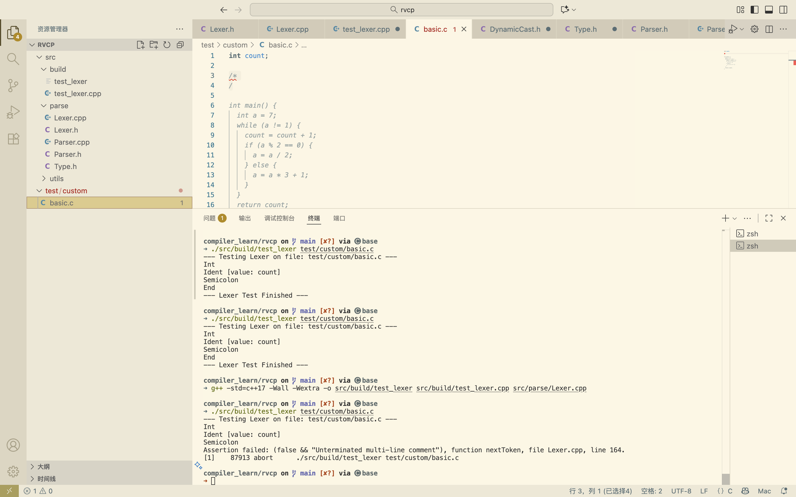
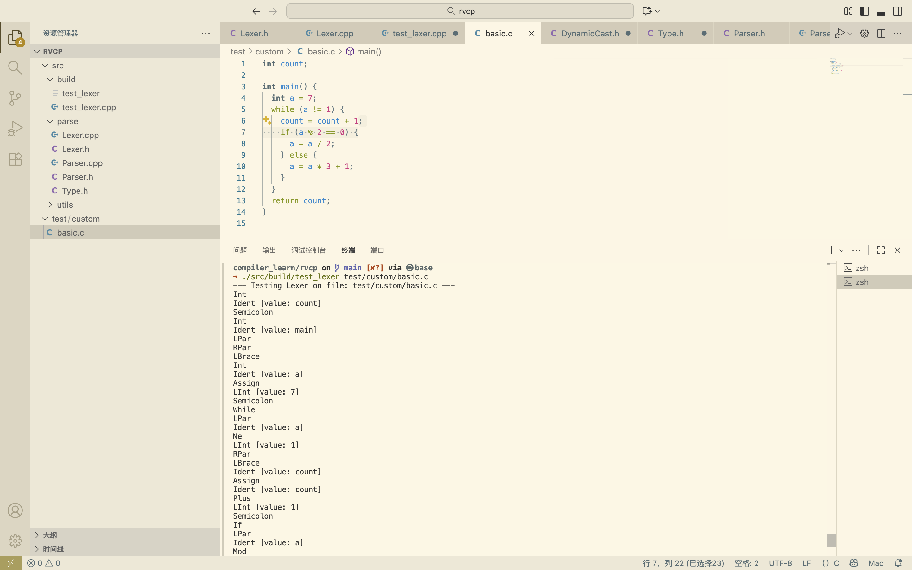

# 2025.11.12 前端——词法分析设计

Lexer 和 Parser 准备手写，其中 Parser 计划设计为简单的递归下降

不用 ANTLR 的原因是我实在配不好环境，其次想挑战一下自己不使用flex/bison，追求代码的灵活性和性能

还有就是，比如说像`int a[3][4] = {{1, 2, 3, 4}, 5, 6, {7}}`这种c语言数组初始化，bison真的能处理好吗（笔者未求解

**Parser**

## **Lexer.h**

定义Token结构体，其成员变量type（类型）和union（值），并给出构造函数
定义Lexer类，为.cpp提供函数声明

```c++
enum Type {
    // Literals
    LInt, LFloat, Ident,

    // Keywords
    If, Else, While, Return, For, Int, Float, Void,
    Const, Break, Continue,

    // Operators
    Minus, Plus, Mul, Div, Mod,
    PlusEq, MinusEq, MulEq, DivEq, ModEq,
    Le, Ge, Gt, Lt, Eq, Ne,
    And, Or, Semicolon, Assign, Not,
    LPar, RPar, LBrak, RBrak, LBrace, RBrace,
    Comma,

    //End
    End,
}type;
```

枚举以上token

```c++
union {
  int vi;
  float vf;
  char *vs;
};
```

使用union进行空间优化，管理值

https://blog.csdn.net/zzZZ20150101/article/details/113882670

需要手动释放空间，析构函数不会在union中调用

`Token` 结构体没有析构函数 (~Token) 来 delete[] vs，这是为了性能（避免在 Parser 中大量创建/销毁 Token 对象产生析构函数的开销）

因此在Parser结束后需要考虑到手动delete

```c++
// Constructors
/* implicit */ Token(Type t): type(t) {}
/* implicit */ Token(int vi): type(LInt), vi(vi) {}
/* implicit */ Token(float vf): type(LFloat), vf(vf) {}
/* implicit */ Token(const std::string &str): type(Ident), vs(new char[str.size() + 1]) {
strcpy(vs, str.c_str());
}
```

允许编译器进行隐式类型转换(方便Token的构造)，但记得注释

构造函数：`:`和`{}`之间为成员初始化列表

`new char[str.size() + 1]`：在heap上分配新内存，并预留'\0'位；取string的char *指针指向分配的空间vs

```c++
class Lexer {
  std::string input;

  // Index of `input`
  size_t loc = 0;
  size_t lineno = 1;
public:
  Lexer(const std::string &input): input(input) {}

  Token nextToken();
  bool hasMore() const;
};
```

结束Token结构体，最后定义Lexer类

注意此处用size_t

此处直接接收完整string，不必处理复杂的 I/O 缓冲，nextToken不用担心是否读到了缓冲区末尾，代价是它无法处理流式输入或超大的源文件


## **Lexer.cpp**

进行字符串识别，并返回Token构造

```c++
std::map<std::string, Token::Type> keywords = {
    {"if", Token::If},
    {"else", Token::Else},
    {"while", Token::While},
    {"return", Token::Return},
    {"for", Token::For},
    {"int", Token::Int},
    {"float", Token::Float},
    {"void", Token::Void},
    {"const", Token::Const},
    {"break", Token::Break},
    {"continue", Token::Continue},
};
```

创建映射表

```c++
bool Lexer::hasMore() const {
    return loc < input.size();
}
```

hasmore( )函数

接下来就是nextToken( )这个核心函数的实现：

```c++
Token Lexer::nextToken() {
    while (hasMore() && std::isspace(input[loc])) {
        if(input[loc] == '\n'){
            lineno++;
        }
        loc++;
    }

    // Hit end of input because of skipping whitespace
    if(loc >= input.size()){
        return Token::End;
    }
```

跳过空格space，检查EOF

```c++
char c = input[loc];

// Identifiers and keywords
if (std::isalpha(c) || c == '_') {
    std::string name;

    while(loc < input.size() && (std::isalnum(input[loc]) || input[loc] == '_')){
        name += input[loc++];
    }

    if(keywords.count(name)){
        return Token(keywords[name]);
    }

    if (name == "stoptime")
        return Token("_sysy_stoptime_" + std::to_string(lineno));
    if (name == "starttime")
        return Token("_sysy_starttime_" + std::to_string(lineno));

    return Token(name);
}
```

标识符和关键词处理

此处，笔者通过修改输入string，插入`stoptime` 或 `starttime` 来进行行数诊断

```c++
// Integer literals
if (std::isdigit(c) || c == '.') {
    int start = loc;
    bool isFloat = false;

    // Skip '0x' or '0X'
    if (c == '0' && (input[loc + 1] == 'x' || input[loc + 1] == 'X')) {
        loc += 2; 
        while(input[loc] == '.' || std::isxdigit(input[loc])){
            if (input[loc] == '.') {
                if (isFloat) break; // Second decimal point, illegal	
                isFloat = true;
            }
            loc++;
        }

        // p or P for hexadecimal floating-point exponent
        if (input[loc] == 'p' || input[loc] == 'P') {
            isFloat = true;
            loc++;
            // 0x1.Ap-2
            if (input[loc] == '+' || input[loc] == '-') {
                loc++;
            }
            while(std::isdigit(input[loc])){
                loc++;
            }
        }

        // Convert the raw string to int or float
        std::string raw = input.substr(start, loc - start);
        return isFloat ? Token(strtof(raw.c_str(), nullptr)) : std::stoi(raw, nullptr, /*base = autodetect*/0);
    }
```

识别数字——十六进制数，此处考虑后缀p指数

`std::stoi` 的第三个参数 `0` 是关键，它允许 `stoi` 自动检测进制（10 进制、8 进制 `0...`、16 进制 `0x...`），其进行Token的隐式构造（前者不可以不要Token，否则一个float、一个int，C++会认为都是float）

```c++
    // normal decimal number
    while(loc < input.size() && (std::isdigit(input[loc]) || input[loc] == '.')){
        if (input[loc] == '.') {
            if (isFloat) break; // Second decimal point
            isFloat = true;
        }
        loc++;
    }

    if (input[loc] == 'e' || input[loc] =='E'){
        isFloat = true;
        loc++;
        if(input[loc] == '+' || input[loc] == '-') {
            loc++;
        }
        while(std::isdigit(input[loc])){
            loc++;
        }
    }

    std::string raw = input.substr(start, loc - start);
    return isFloat ? Token(strtof(raw.c_str(), nullptr)) : std::stoi(raw, nullptr, /*base = autodetect*/0);
}
```

识别数字——十进制数，此处考虑后缀e指数

```c++
// Operators and punctuation
switch (c) {
    ...
}
switch (c) {
    ...
}
```

此处见源码，分为单字符和多字符两种处理，先处理了多字符的switch，注意break和return

特别处理了 c == '/' 的分支情况:

```c++
assert(false && "Unterminated single-line comment");
return Token::End;
...
assert(false && "Unterminated multi-line comment");
return Token::End;
...
assert(false && "Unknown character in input");
return Token::End;
```

在Debug和release模式下都能进行有效处理


## 测试

> compiler_learn/rvcp on  main [✘?] via 🅒 base 
> ➜ tree .   
> .
> ├── src
> │   ├── build
> │   │   ├── test_lexer
> │   │   └── test_lexer.cpp
> │   ├── parse
> │   │   ├── Lexer.cpp
> │   │   ├── Lexer.h
> │   │   ├── Parser.cpp
> │   │   ├── Parser.h
> │   │   └── Type.h
> │   └── utils
> │       └── DynamicCast.h
> └── test
>     └── custom
>         └── basic.c

```shell
compiler_learn/rvcp on  main [✘?] via 🅒 base 
➜ g++ -std=c++17 -Wall -Wextra -o src/build/test_lexer src/build/test_lexer.cpp src/parse/Lexer.cpp
```

```shell
compiler_learn/rvcp on  main [✘?] via 🅒 base 
➜ ./src/build/test_lexer test/custom/basic.c  
```



应对错误的程序，能进行assert

