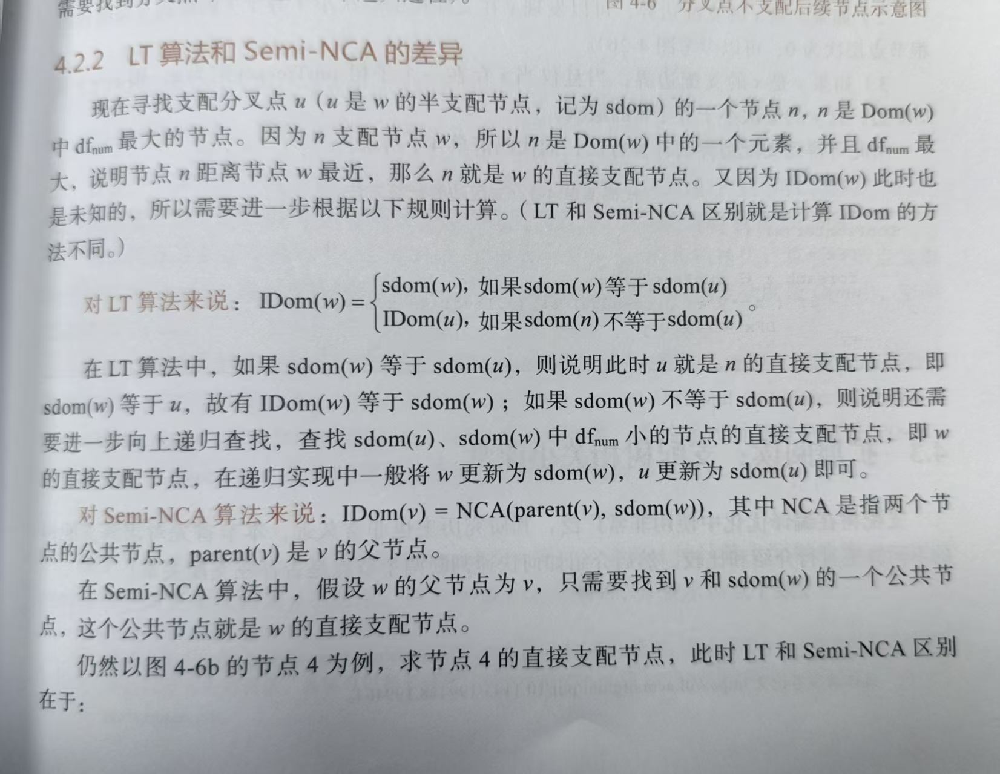

# 2025.12.6 后端codegen——IR具体实现和CFG分析

基于 Lengauer-Tarjan 算法文章:

`https://www.cs.princeton.edu/courses/archive/fall03/cs528/handouts/a%20fast%20algorithm%20for%20finding.pdf`

来构建支配树及其衍生结构，利用深度优先搜索和路径压缩技术实现了近乎线性的时间复杂度

**引入半支配者概念：**

$sdom(w)$ 是指在 DFS 生成树中，能够通过一条路径到达 $w$，且路径上除了起点和终点外，所有节点的 DFS 序号都大于 $w$ 的那个“序号最小”的祖先节点`best[w]`

通俗点说：**$sdom(bb)$ 是 CFG 图中能绕过 $bb$ 的父节点，直接或者间接“跳”到 $bb$  的最高层节点**


**OpBase.cpp**



实现的`updateDoms` 函数完整地复现了论文中描述的快速支配者查找算法的四个步骤

首先，调用 `updatePreds()` 确保图的连接关系是最新的。然后清理旧数据（`doms`, `idom`）

```c++
updatePreds();
// Clear existing data.
for (auto bb : bbs) {
    bb->doms.clear();
    bb->idom = nullptr;
}

// Clear global data as well.
dfn.clear();
sdom.clear();
vertex.clear();
parents.clear();
uf.clear();
best.clear();
num = 1;
```

接着调用 `updateDFN(entry)` 从入口块开始进行深度优先搜索，为每个基本块分配一个 DFS 序号（`dfn`），并记录其在 DFS 生成树中的父节点（`parents`）

```c++
// For each 'u' as key, it contains all blocks that it semi-dominates.
// 'b' for bucket.
std::map<BasicBlock*, std::vector<BasicBlock*>> bsdom;
auto entry = getFirstBlock();
updateDFN(entry);

for (auto bb : bbs) {
    sdom[bb] = bb;
    uf[bb] = bb;
    best[bb] = bb;
}
```

接着，代码按 DFS **逆序遍历**节点进行**后向分析**（**为什么逆序遍历？** 因为计算 `bb` 的半支配者时，可能需要利用 `bb` 的后代节点（通过后向边）的信息。只有先处理完后代，后代的并查集信息（`best`）才是就绪的），利用 `find` 函数（即论文中的 `EVAL`）和前驱节点信息来计算半支配者`semi-dominates`

依据是论文中的 Theorem 4 

$$sdom(w) = \min ( \{ v \mid (v, w) \in E, v < w \} \cup \{ sdom(u) \mid u > w, \exists (v, w) \in E, u \overset{*}{\to} v \} )$$

1. **$v < w$**：$v$ 是 $w$ 在 DFS 生成树中的**祖先**（或者是此时尚未处理的跨边前驱）。此时，$v$ 本身就是一个可能的半支配者候选
2. **$v > w$**：$v$ 是 $w$ 的**后代**（或者是在 DFS 树中位于右侧的跨边前驱）。此时，$v$ 已经被处理过了（因为算法是按 DFS 逆序进行的）。我们需要在 $v$ 的祖先链（在当前的森林中）中，找到一个节点 $u$，使得 $sdom(u)$ 的 DFS 序最小。这个 $sdom(u)$ 就是 $w$ 的半支配者候选

```c++
// Deal with every block in reverse dfn order.
for (auto it = vertex.rbegin(); it != vertex.rend(); it++) {
    auto bb = *it;
    for (auto v : bb->preds) {
      // Unreachable. Skip it.
      if (!dfn.count(v))
          continue;
      BasicBlock *u;
      if (dfn[v] < dfn[bb])
          u = v;
      else {
          find(v);
          u = best[v];
      }
      if (dfn[sdom[u]] < dfn[sdom[bb]])
          sdom[bb] = sdom[u];
		}
```

计算完 `sdom` 后，将 `bb` 加入到其半支配者的桶 `bsdom` 中，并调用 `link`（即论文中的 LINK 操作 ）将 `bb` 连接到其 DFS 树父节点 `parents[bb]` 下，`uf[bb] = parents[bb]`用于接下来循环中的find(v)去查找中间节点的best

```c++
bsdom[sdom[bb]].push_back(bb);
link(parents[bb], bb);
```

随后，处理父节点桶中的所有待处理节点 `v`。依据论文中的 Corollary 1 ，如果 `v` 的半支配者等于其“最佳”节点的半支配者，则直接支配者 `idom` 就是其父节点；否则，`idom` 设置为那个“最佳”节点（留待后续修正）
$$
idom(w) = \begin{cases} sdom(w) & (sdom(u) = sdom(w)) \\ idom(u) & (sdom(u) < sdom(w)) \end{cases}
$$

```c++
    for (auto v : bsdom[parents[bb]]) {
      find(v);
      v->idom = sdom[best[v]] == sdom[v] ? parents[bb] : best[v];
    }
}
```

最后，按 DFS 正序（跳过入口块）遍历所有节点，修正直接支配者。如果节点 `bb` 的直接支配者不等于其半支配者（说明在上一步记录的是中间结果），则将其更新为 `idom[bb]->idom`即 `best[bb]->idom`

```c++
// Find idom, but ignore the entry block (which has no idom).
  for (int i = 1; i < vertex.size(); ++i) {
      auto bb = vertex[i];
      assert(bb->idom);
      if (bb->idom != sdom[bb])
      bb->idom = bb->idom->idom;
  }
}
```


`updateDomFront` 函数用于计算支配边界，是构建 SSA 形式的关键。首先调用 `updateDoms` 确保支配树是最新的，并清空旧数据。

```c++
void Region::updateDomFront() {
    updateDoms();
    for (auto bb : bbs)
        bb->domFront.clear();
```

算法遍历所有汇合点（即前驱数量 `>= 2` 的基本块）。对于每个汇合点 `bb` 的每一个前驱 `pred`，从 `pred` 开始沿着支配树（IDom 链）向上回溯，直到遇到 `bb` 的直接支配者 `idom` 为止（不包含 `idom`）。路径上的所有节点 `runner` 都将 `bb` 加入到自己的支配边界 `domFront` 中

```c++
// Update dominance frontier.
// See https://en.wikipedia.org/wiki/Static_single-assignment_form#Computing_minimal_SSA_using_dominance_frontiers
// For each block, if it has at least 2 preds, then it must be at dominance frontier of all its `preds`,
// till its `idom`.
for (auto bb : bbs) {
    if (bb->preds.size() < 2)
    continue;

    for (auto pred : bb->preds) {
        auto runner = pred;
        while (runner != bb->idom) {
            runner->domFront.insert(bb);
            runner = runner->idom;
        }
    }
}
}
```


`updatePDoms` 是 `updateDoms` 的完全对偶版本，用于计算逆支配树，这通常用于控制依赖分析。首先更新前驱信息，然后识别函数的出口块（以 `ReturnOp` 结尾的块）。如果没有唯一的出口块，则报错

```cpp
// A dual of updateDoms().
void Region::updatePDoms() {
    updatePreds();

    std::vector<BasicBlock*> exits;
    for (auto bb : bbs) {
        if (isa<ReturnOp>(bb->getLastOp()))
        exits.push_back(bb);
    }

    if (exits.size() != 1) {
        std::cerr << "no single exit for pdom\n";
        assert(false);
    }

    auto exit = exits[0];
```

初始化相关数据结构，注意这里使用的是带 `p` 前缀的变量（如 `pdoms`, `pdfn` 等），用于存储反向图的分析结果。调用 `updatePDFN` 从出口块开始进行反向深度优先搜索（遍历 `preds` 而非 `succs`）

```c++
for (auto bb : bbs) {
    bb->pdoms.clear();
    bb->ipdom = nullptr;
}

pdfn.clear();
pvertex.clear();
pparents.clear();
psdom.clear();
puf.clear();
pbest.clear();
pnum = 1;

std::map<BasicBlock*, std::vector<BasicBlock*>> pbsdom;

updatePDFN(exit);

for (auto bb : bbs) {
    psdom[bb] = bb;
    puf[bb] = bb;
    pbest[bb] = bb;
}
```

核心循环逻辑与 `updateDoms` 完全一致，但在反向图上操作：按反向 DFS 逆序遍历节点，在计算半支配者时遍历**后继节点** (`succs`) 而非前驱。使用 `pfind` 和 `plink` 维护森林结构。

```cpp
for (auto it = pvertex.rbegin(); it != pvertex.rend(); ++it) {
    auto bb = *it;
    for (auto v : bb->succs) {
        if (!pdfn.count(v))
            continue;
        BasicBlock *u;
        if (pdfn[v] < pdfn[bb])
            u = v;
        else {
            pfind(v);
            u = pbest[v];
        }
        if (pdfn[psdom[u]] < pdfn[psdom[bb]])
            psdom[bb] = psdom[u];
    }

    pbsdom[psdom[bb]].push_back(bb);
    plink(pparents[bb], bb);

    for (auto *v : pbsdom[pparents[bb]]) {
        pfind(v);
        v->ipdom = (psdom[pbest[v]] == psdom[v]) ? pparents[bb] : pbest[v];
    }
}
```

最后，同样通过正向遍历修正所有节点的直接后支配者 `ipdom`

```c++
    for (size_t i = 1; i < pvertex.size(); ++i) {
        auto bb = pvertex[i];
        assert(bb->ipdom);
        if (bb->ipdom != psdom[bb])
        bb->ipdom = bb->ipdom->ipdom;
    }
}
```