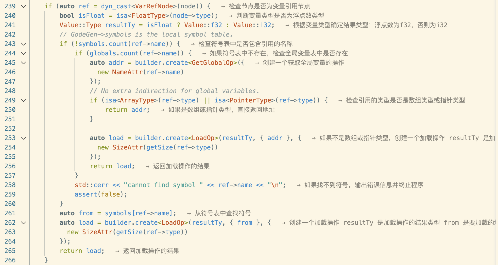
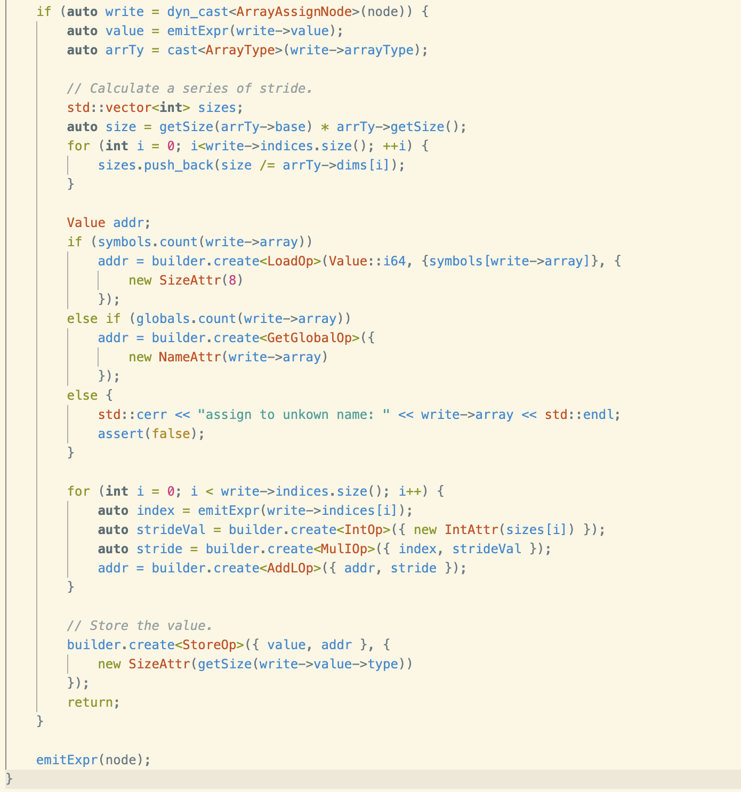
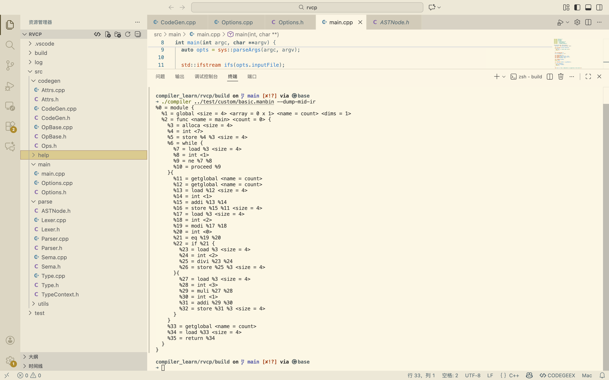

# 2025.12.10 后端codegen——IR Builder

今天完成CodeGen，IR构建部分

## CodeGen

CodeGen 所生成的 IR 参考了 MLIR 的 `scf` 方言的设计方式。作为一个例子，考虑这样的一段代码：

```cpp
int main() {
  int i = 0, sum = 0, n = getint();
  while (i < n) {
    sum = sum + i;
    i = i + 1;
  }
  putint(sum);
}
```


它会生成这样的 IR：

```plaintext
%0 = module {
  %1 = func <name = main> <count = 0> {
    %2 = alloca <size = 4>
    %3 = alloca <size = 4>
    %4 = alloca <size = 4>
    %5 = int <0>
    %6 = store %5 %2 <size = 4>
    %7 = int <0>
    %8 = store %7 %3 <size = 4>
    %9 = call <name = getint>
    %10 = store %9 %4 <size = 4>
    %11 = while {
      %12 = load %2 <size = 4>
      %13 = load %4 <size = 4>
      %14 = lt %12 %13
      %15 = proceed %14
    }{
      %16 = load %3 <size = 4>
      %17 = load %2 <size = 4>
      %18 = addi %16 %17
      %19 = store %18 %3 <size = 4>
      %20 = load %2 <size = 4>
      %21 = int <1>
      %22 = addi %20 %21
      %23 = store %22 %2 <size = 4>
    }
    %24 = load %3 <size = 4>
    %25 = call %24 <name = putint>
    %26 = int <0>
    %27 = return %26
  }
}
```

这里的 IR 依旧保存了结构化控制流。虽然 `module`, `while` 等 Op 也有一个形式上的返回值，但它们实际上不会被使用。由于每个 Op 仅能返回一个值，我无法实现类似 `scf.yield` 的内容，不过目前来说，这种设计已经够用了。

在打印出的 IR 中以 `<>` 包裹的是属性（`Attr*`）。它们不属于操作数。

这样的树形 IR 能够方便代码生成，同时能让循环优化变得直观

后续在 `pre-opt` 文件夹中的一系列优化结束后，它会被 FlattenCFG 展平，形成和 LLVM IR 类似的模式，然后被 `opt` 中的 pass 进一步优化

### 

## **CodeGen.cpp**

在Node处理过程中，在Ops.h中进行Op指令的扩展

注意区分数组的存储方式：符号表存的是——**指向数组基地址的指针**的地址，因此是8字节

```c++
        auto from = symbols[ref->name];
        auto load = builder.create<LoadOp>(resultTy, { from }, {
          new SizeAttr(getSize(ref->type))
        });
```



```c++
        if (symbols.count(write->array)) 
            addr = builder.create<LoadOp>(Value::i64, {symbols[write->array]}, {
                new SizeAttr(8)
            });
```



对builder光标进行操作时，注意进行作用域保护


**1. 表达式节点 (Expressions)**

这些节点在 `emitExpr` 中处理，它们负责计算并返回一个 `Value` (IR 中的值)。

- **`BinaryNode`**: 二元运算

- **`UnaryNode`**: 一元运算

  ```c++
      if (auto binary = dyn_cast<BinaryNode>(node)) {
          return emitBinary(binary);
      }
  
      if (auto unary = dyn_cast<UnaryNode>(node)) {
          return emitUnary(unary);
      }
  ```

- **`IntNode`**: 整数整数字面量

- **`FloatNode`**: 浮点数字面量

- **`VarRefNode`**: 变量引用

  读取变量的值，区分全局和局部，标量和数组指针

  指针直接返回地址addr，用符号表存储string->Value

  非指针则LoadOp对应地址的Value

- **`CallNode`**: 函数调用

  包括对 `starttime` 和 `stoptime` 的特殊处理

- **`ArrayAccessNode`**: 数组元素访问

  读取数组的具体元素，涉及多维数组地址计算

  对于多维数组的高维访问直接返回addr

**2. 语句与结构节点 (Statements & Structures)**

这些节点在 `emit` 中处理，它们不返回值，而是生成控制流、内存操作或作用域管理指令。

- **`EmptyNode`**: 空语句（通常是多余的分号 `;`），直接返回

- **`BlockNode`**: 代码块 `{ ... }`，会引入新的 `SemanticScope`

- **`TransparentBlockNode`**: 透明代码块，区分于BlockNode不引入新作用域

- **`FnDeclNode`**: 函数定义

  负责生成 `FuncOp`

  ```c++
          //Fuction arguments are in the same scope with body.
          SemanticScope scope(*this);
  ```

  处理参数（将参数 `Store` 到栈上），并遍历函数体，需要将参数留在作用域内，避免符号表污染

  ```c++
              // Mark address as floating point if necessary.
              if (isa<FloatType>(argTy))
                  addr->add<FPAttr>();
  ```

  如果是float，需要特别标记对应地址

- ！！！**`VarDeclNode`**: 变量声明

  - 处理 **全局变量** (`GlobalOp`)
  - 处理 **局部变量** (`AllocaOp`)
  - 处理 **数组初始化**（区分常量初始化和运行时循环初始化）

- **`WhileNode`**: While 循环

  生成 `WhileOp` 和 `ProceedOp`，利用 Block 构建循环结构

- **`ReturnNode`**: 返回语句

  区分有返回值和无返回值的情况

- **`IfNode`**: If-Else 条件分支

  生成 `IfOp` 和相应的 Region

- **`ContinueNode`**: Continue 语句

  生成 `ContinueOp`

- **`BreakNode`**: Break 语句

  生成 `BreakOp`

- **`AssignNode`**: 赋值语句（标量）

  用于给变量（`VarRefNode`）写入新值

- **`ArrayAssignNode`**: 数组赋值语句

  用于给数组的具体元素写入新值（同`ArrayAccessNode`涉及多维地址计算）

**3. 嵌套处理的节点 (Nested Handling)**

这些节点没有在顶层 `emit` 或 `emitExpr` 的 `if/else` 链中直接出现，而是在 `VarDeclNode` 的内部逻辑中被处理：

- **`ConstArrayNode`**: 用于全局变量或静态常量的数组初始化数据
- **`LocalArrayNode`**: 用于局部数组的初始化列表

### 

## 这里特别注意`VarDeclNode`

此处进行全局标量的“数组化”， `DimensionAttr({1})`处理让后端可以将所有全局符号统一视为地址标签，简化 `GetGlobalOp` 的处理逻辑

对于Value值，在定义处（`addr->defining->add<FPAttr>()`）添加浮点属性

对于指针，则直接在地址处（`addr->add<FPAttr>()`）添加浮点属性


| **特性**                      | **全局变量 (GlobalOp)**     | **局部变量 (AllocaOp)**                |
| ----------------------------- | --------------------------- | :------------------------------------- |
| **名字属性 (NameAttr)**       | **必须有** (作为汇编 Label) | **不需要** (用栈偏移量寻址)            |
| **初始值属性 (IntArrayAttr)** | **必须有** (写入 .data 段)  | **不需要** (由 `Store` 指令动态写入)   |
| **内存分配**                  | 链接器静态分配              | 函数序言 (Prologue) 动态分配栈         |
| **初始化方式**                | `.word` 数据指令            | 一系列 `Store` 指令或 `memset` 循环    |
| **数组处理**                  | 直接返回地址 (Label)        | 需要额外创建一个指针变量 (Indirection) |

```c++
// global
						Value addr;
            if (isa<FloatType>(base)) {
                addr = builder.create<GlobalOp>({
                    new SizeAttr(getSize(vardecl->type)),
                    new FloatArrayAttr((float*) value, size),
                    new NameAttr(vardecl->name),
                    new DimensionAttr(arrTy ? arrTy->dims : std::vector<int>{1})
                });
                addr.defining->add<FPAttr>();
            } else {
                addr = builder.create<GlobalOp>({
                    new SizeAttr(getSize(vardecl->type)),
                    new IntArrayAttr((int*) value, size),
                    new NameAttr(vardecl->name),
                    new DimensionAttr(arrTy ? arrTy->dims : std::vector<int>{1})
                });
            }
            globals[vardecl->name] = addr;
```

```c++
// local
				auto addr = builder.create<AllocaOp>({
            new SizeAttr(getSize(vardecl->type))
        });

        if (isa<FloatType>(vardecl->type))
            addr->add<FPAttr>();
        symbols[vardecl->name] = addr;
```


```c++
       if (vardecl->init) {
            // This is a local variable with array initializer.
            //We manually load everthing into the array.
            if (auto arr = dyn_cast<LocalArrayNode>(vardecl->init)) {
                auto arrTy = cast<ArrayType>(vardecl->type);
                auto base = arrTy->base;
                auto arrSize = arrTy->getSize();
                auto baseSize = getSize(arrTy->base);
                int zeroFrom = arrSize - 1;
                for (; zeroFrom >=0; zeroFrom--) {
                    if (arr->elements[zeroFrom])
                        break;
                }
```

其次对于大规模局部未初始化数组，设置阈值并实现循环补零功能（创建loop块），避免大量StoreOp IR生成，仅仅也就是为了减少IR冗余，CPU对应执行没有减少！

此处zeroFrom是最后一个非0初始化元素对应的索引值，zeroFrom+1则是需要补零的start

```c++
                // Now [zeroFrom + 1， arrSize] are all zeros.
                // We don't want to create too many stores,thus we create a loop instead.
                int max = arrSize - zeroFrom >= 11210 ? zeroFrom : arrSize;
                for (int i = 0; i < max; i++) {
                    // check whether it's pointer.
                    Value value = arr->elements[i] ?
                        emitExpr(arr->elements[i]) :
                        (isa<FloatType>(base) ?
                            (Value) builder.create<FloatOp>({ new FloatAttr(0) }) :
                            (Value) builder.create<IntOp>({ new IntAttr(0) }) );

                    auto offset = builder.create<IntOp>({ new IntAttr(i * baseSize) });
                    auto place = builder.create<AddLOp>({ addr, offset });
                    builder.create<StoreOp>({ value, place }, { new SizeAttr(baseSize) });
                }
```

以上是小规模，未超过阈值，则完全进行平铺所有元素即可

以下则是超过阈值，实现loop的情况

```c++
                if (max != arrSize) {
                    auto start = builder.create<IntOp>({ new IntAttr(zeroFrom + 1)});
                    auto end = builder.create<IntOp>({ new IntAttr(arrSize) });
                    auto iv = builder.create<AllocaOp>({ new SizeAttr(4) });
                    auto zero = isa<FloatType>(base) ?
                        (Value) builder.create<FloatOp>({ new FloatAttr(0) }) :
                        (Value) builder.create<IntOp>({ new IntAttr(0) }) ;
                    auto stride = builder.create<IntOp> ({ new IntAttr(baseSize) });
                    auto incr = builder.create<IntOp> ({ new IntAttr(1) });
                    auto loop = builder.create<ForOp>({ start, end, incr, iv });
                    auto body = loop->appendRegion();
                    body->appendBlock();
                    {
                        Builder::Guard guard(builder);
                        builder.setToRegionStart(body);
                        auto offset = builder.create<MulIOp>({ loop, stride });
                        auto place = builder.create<AddLOp>({ addr, offset });
                        builder.create<StoreOp>({ zero, place });
                    }
                }
```




