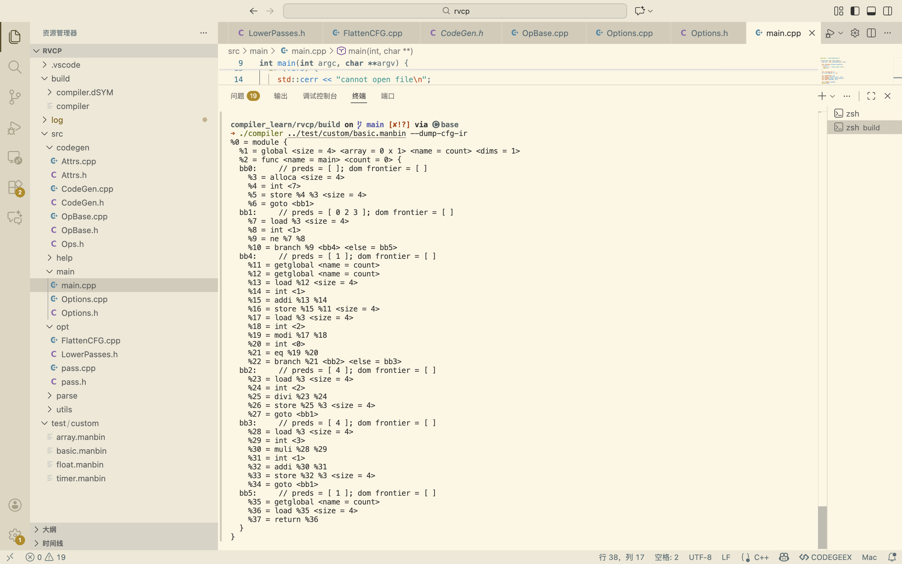
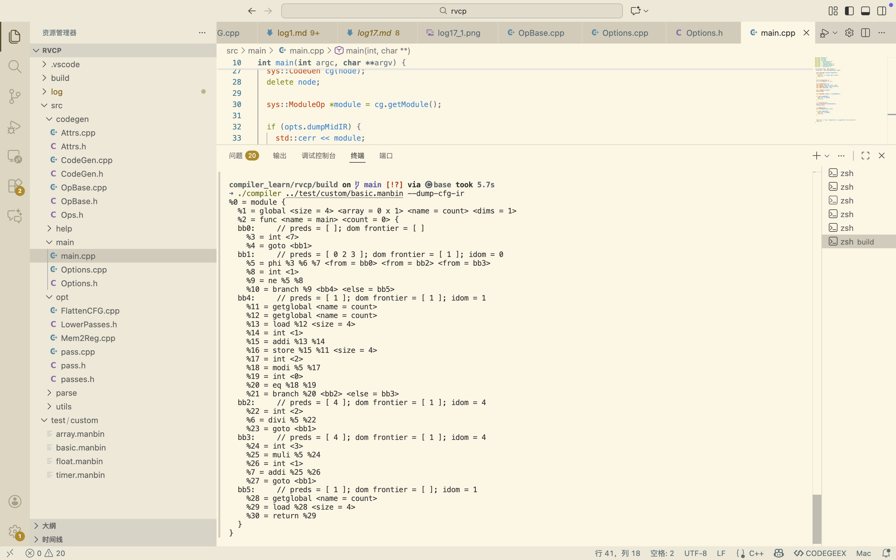

# 2025.12.14 后端Opt——Mem2Reg pass

`CodeGen` 阶段，为了简化代码生成的逻辑，通常会将所有的局部变量都分配在栈上（使用 `AllocaOp`），并通过 `LoadOp` 和 `StoreOp` 进行读写，所有的变量访问都变成了内存操作（RISC-V 中的 `lw`/`sw`），这比直接访问寄存器要慢得多

`Mem2Reg` 的作用就是消除这些不必要的内存操作，构建出高效的 SSA 形式 IR

主要是对phi节点插入进行了分析（此时需要考虑支配边界，补充支配树算法）、进行变量重命名（包括符号表维护、指令替换等）


## pass.h & pass.cpp & passes.h

添加`using DomTree = std::unordered_map<BasicBlock *, std::vector<BasicBlock *>>;`

实现`DomTree getDomTree(Region *region);`

```c++
DomTree Pass::getDomTree(Region *region)
{
    region->updateDoms();

    DomTree tree;
    for (auto bb : region->getBlocks())
    {
        if (auto idom = bb->getIdom())
            tree[idom].push_back(bb);
    }
    return tree;
}
```

```c++
// Converts alloca's to SSA values.
// This must run on flattened CFG, otherwise `break` and `continue` are hard to deal with.
class Mem2Reg : public Pass {
  int count = 0;  // Total converted count
  int missed = 0; // Unconvertible alloca's

  // Maps AllocaOp* to Value (the real value of this alloca).
  using SymbolTable = std::map<Op*, Value>;

  void runImpl(FuncOp *func);
  void fillPhi(BasicBlock *bb, SymbolTable symbols);
  
  // Maps phi to alloca.
  std::map<Op*, Op*> phiFrom;
  std::set<BasicBlock*> visited;
  // Allocas we're going to convert in the pass.
  std::set<Op*> converted;
  DomTree domtree;
public:
  Mem2Reg(ModuleOp *module): Pass(module) {}
    
  std::string name() override { return "mem2reg"; };
  std::map<std::string, int> stats() override;
  void run() override;
};
```

跟LowerPasses.h一样都是存的类头文件，后续大部分pass的类定义就放在passes里


## Mem2Reg.cpp

详见源码，注册这个pass时，需要注意他放在main.cpp中的位置

测试basic.manbin:
加入pass前：

加入pass后：


**Phi 节点生成成功**： 在 `bb1`（循环头）中出现了 `%5 = phi %3 %6 %7 <from = bb0> <from = bb2> <from = bb3>`

- 它正确地合并了来自入口 `bb0` 的初始值 `%3` (7)
- 以及来自两个回边 `bb2` 的 `%6` 和 `bb3` 的 `%7`

**栈操作消失**：

- 原来的 `alloca`, `load`, `store` 指令全部消失了
- 后续的指令直接使用了虚拟寄存器 `%5` 进行计算（如 `ne %5 %8`, `modi %5 %17`）

**全局变量保留**：

- `count` 是全局变量，`Mem2Reg` 正确地没有去动它（依然保留了 `load`/`store`），这是符合预期的，因为全局变量可能有别名或副作用，不能简单提升为寄存器