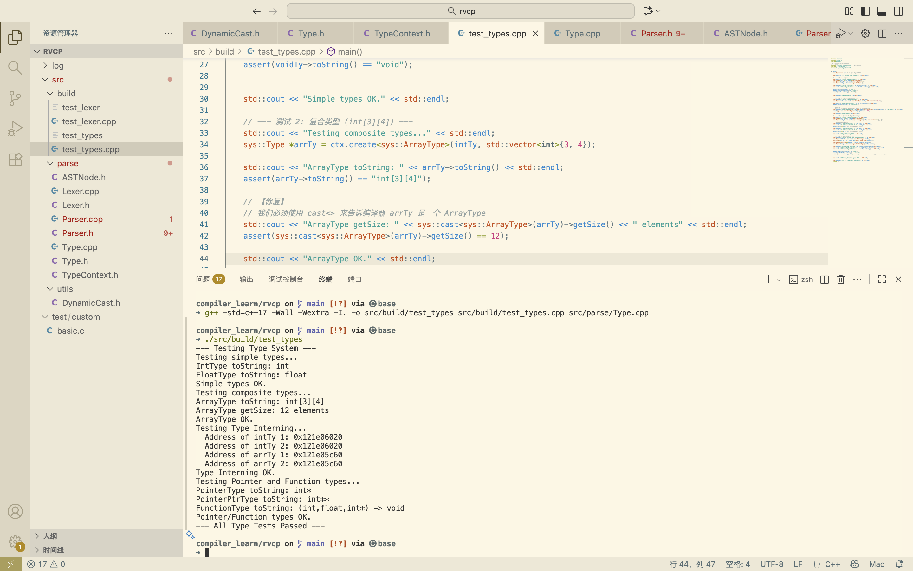

# 2025.11.13 前端 —— 语法分析前ASTNode定义

用utils存一些辅助头文件

`src/utils/DynamicCast.h`

## DynamicCast.h

参考LLVM实现

https://stackoverflow.com/questions/6038330/how-is-llvm-isa-implemented

LLVM 广泛使用了一种手工实现的 RTTI 形式，它使用诸如 isa<>、cast<> 和 dyn_cast<> 之类的模板

是其他文件实现继承和多态的基础

```c++
#ifndef DYNAMICCAST_H
#define DYNAMICCAST_H

namespace sys {

template<typename T, typename U>
bool isa(U *t) {
    return T::classof(t);
}
  
template<typename T, typename U>
T* cast(U *t) {
    assert(isa<T>(t) && "Invalid cast!");
    return (T*) t;
}

template<typename T, typename U>
T* dyn_cast(U *t) {
    if (isa<T>(t)) {
        return cast<T>(t);
    }
    return nullptr;
}

}
#endif // DYNAMICCAST_H
```


## Type.h

```c++
class Type {
    const int id;
public:
    int getID() const { return id; }
    virtual std::string toString() const = 0;
    virtual ~Type() {}
    Type(int id): id(id) {}
};
```

定义Type基类，私有ID，通过getID进行获取

此处用虚函数，支持多态，其派生类可复用

`const = 0`表示在基类中不用实现该函数

```c++
template<class T,int TypeID>
class TypeImpl : public Type {
public:
  static bool classof(Type *ty) {
      return ty->getID() == TypeID;
  }
  TypeImpl(): Type(TypeID) {}
};
```

定义TypeImpl实现类template，方便后续各类型定义

isa<>调用classof

Isa(U *t) 此处t就是指向Type基类的指针——Type *ty

```c++
class IntType : public TypeImpl<IntType, __LINE__> {
public:
  std::string toString() const override {
    return "int";
  }
};

class FloatType : public TypeImpl<FloatType, __LINE__> {
public:
  std::string toString() const override {
    return "float"; 
  }
};

class VoidType : public TypeImpl<VoidType, __LINE__> {
public:
  std::string toString() const override { return "void"; }
};
```

定义简单的派生类

使用TypeImpl的模板，不需要反复写构造函数了，只需要专注于虚函数的重写

以行号为ID，保证实例获得唯一ID

```c++
class PointerType : public TypeImpl<PointerType, __LINE__> {
public:
    Type *baseType;
    PointerType(Type *baseType): baseType(baseType) {}
    std::string toString() const override {
        return baseType->toString() + "*";
    }
};

class FunctionType : public TypeImpl<FunctionType, __LINE__> {
public:
  Type *ret;
  std::vector<Type*> params;
  FunctionType(Type *ret, std::vector<Type*> params):
    ret(ret), params(params) {}

  std::string toString() const override;
};

class ArrayType : public TypeImpl<ArrayType, __LINE__> {
public:
  Type *base;
  std::vector<int> dims;
  ArrayType(Type *base, std::vector<int> dims):
    base(base), dims(dims) {}

  std::string toString() const override;
  int getSize() const;
};
```

定义复杂的派生类，会有独特的成员变量，因此需要新的构造函数来初始化成员变量

指针类考虑到基类型（解引用的值）

函数类考虑到返回值和参数的类型，此处toString较复杂，可以先空着，但留下重写声明

数组类考虑到基类型和维度，getsize获取参数个数


## Type.cpp

用来实现.h中待实现的声明函数

`#include <sstream>`

```c++
std::string interleave(const std::vector<Type*> &types) {
    std::ostringstream oss;
    for (size_t i = 0; i < types.size(); ++i) {
        oss << types[i]->toString();
        if (i != types.size() - 1) {
            oss << ",";
        }
    }
    return oss.str();
}
```

对Type*集合进行toString处理，特殊处理,的布局

`oss.str()` 是  `std::ostringstream` 对象的一个成员函数，来获取 `oss` 内部到目前为止累积的所有内容的最终 `std::string` 拷贝

```c++
std::string FunctionType::toString() const {
  return "(" + interleave(params) + ") -> " + ret->toString();
}

std::string ArrayType::toString() const {
  std::stringstream oss;
  oss << base->toString();
  for (auto x : dims)
    oss << "[" << x << "]";
  return oss.str();
}
```

(1,2,3) -> int

x是int类型，最后得到如 int[2] [3]

```cpp
// not byte size, but number of elements
int ArrayType::getSize() const {
  int size = 1;
  for (auto x : dims)
    size *= x;
  return size;
```

获取参数个数 

int[ 2] [ 3] [ 4].  即 2 * 3 * 4 =24 


## TypeContext.h

用来统一管理Type，自定义Hash对ID进行唯一化，即对类型进行唯一化

并管理内存空间，即时delete创建的类型

https://codereview.stackexchange.com/questions/276890/c-hash-table-hash-function-benchmark-vs-stdunordered-set-and-stdhash

```c++
struct Hash {
    size_t operator()(Type *ty) const {
        size_t hash = ty->getID();

        if(auto arr = dyn_cast<ArrayType>(ty)){
            hash = (hash << 4) + Hash()(arr->base);
            for (auto d : arr->dims) {
                hash *= (d + 1);
            }
        }

        if(auto fn = dyn_cast<FunctionType>(ty)) {
            hash = (hash << 4) + Hash()(fn->ret);
            for (auto p : fn->params) {
                hash = (hash << 1) + Hash()(p);
            }
        }

        if(auto ptr = dyn_cast<PointerType>(ty)) {
            hash = (hash << 4) + Hash()(ptr->baseType);
        }

        return hash;
    }
};
```

operator()(Type *ty) 重载函数调用运算符，使 `Hash` 结构体可以像函数一样被 `unordered_set` 调用 :	`Hash()(arr->base)`

递归处理

自定义如下：

1. 统一ID先左移4位，拉大差距
2. 数组类型，加基类型的哈希做偏移，再对各维度进行累乘，注意是d+1，避免d==0，ID归零
3. 函数类型，加返回类型的哈希做偏移，再对各参数进行先左移1位然后加参数类型哈希做偏移
4. 指针类型，加指针基类型的哈希做偏移

```cpp
struct Eq {
    bool operator()(Type *a, Type *b) const {
        if (a->getID() != b->getID()) return false;

        if (auto arrA = dyn_cast<ArrayType>(a)) {
            auto arrB = dyn_cast<ArrayType>(b);
            if (arrA->dims.size() != arrB->dims.size()) return false;
            for (size_t i = 0; i < arrA->dims.size(); ++i) {
                if (arrA->dims[i] != arrB->dims[i]) return false;
            }
            return Eq()(arrA->base, arrB->base);
        }

        if (auto fnA = dyn_cast<FunctionType>(a)) {
            auto fnB = dyn_cast<FunctionType>(b);
            if (fnA->params.size() != fnB->params.size()) return false;
            for (size_t i = 0; i < fnA->params.size(); ++i) {
                if (!Eq()(fnA->params[i], fnB->params[i])) return false;
            }
            return Eq()(fnA->ret, fnB->ret);
        }

        if (auto ptrA = dyn_cast<PointerType>(a)) {
            auto ptrB = dyn_cast<PointerType>(b);
            return Eq()(ptrA->baseType, ptrB->baseType);
        }
        return true; // for simple types
    }
};
```

自定义等价

当 `Hash` 产生**哈希冲突**时（两个不同的类型产生了相同的哈希值），`unordered_set` 会调用这个 `Eq` 函数来做裁决

递归判断

自定义以下规则：

1. 统一先判断ID是否相同
2. 数组类型，判断维度是否相同，然后再判断各个维度的值是否相同，递归判断存的类型
3. 函数类型，判断参数个数，然后遍历递归判断参数类型
4. 指针类型，判断基类型

```c++
// class TypeContext
		std::unordered_set<Type*, Hash, Eq> content;

public:
    template<class T, class... Args>
    T *create(Args... args) {
        auto ptr = new T(std::forward<Args>(args)...);
        if (auto [it, absent] = content.insert(ptr); !absent) {
            delete ptr;
            return cast<T>(*it);
        }
        return ptr;
    }

    ~TypeContext() {
        for (auto x : content)
        delete x;
    }
};
```

unordered _set哈希集合存储所有唯一Type*，提醒使用Hash, Eq结构体

`new T(std::forward<Args>(args)...)`，记住用法forward< Args >(args)...

在堆上 `new` 一个新类型，例如 `new ArrayType(base, dims)`

`auto [it, absent] = content.insert(ptr); !absent`

it为迭代器，absent表示缺席，`!absent`：检查插入是否失败（即类型已存在）

尝试将新创建的 `ptr` 插入哈希集合。`Hash` 和 `Eq` 会被调用来检查是否已存在一个语义上相等的类型

如果存在，删除ptr，并返回转型的*it

析构TypeContext，则将哈希集合的所有Type*进行delete


## 测试

```shell
compiler_learn/rvcp on  main [!?] via 🅒 base 
➜ g++ -std=c++17 -Wall -Wextra -I. -o src/build/test_types src/build/test_types.cpp src/parse/Type.cpp

compiler_learn/rvcp on  main [!?] via 🅒 base 
➜ ./src/build/test_types    
```



`test_types.cpp`：

**类型系统的基本功能**：

- `TypeContext` 工厂可以被成功创建。
- `ctx.create<T>()` 可以正确创建**简单类型**（`IntType`, `FloatType`, `VoidType`）。
- `ctx.create<T>(...)` 可以正确创建**复合类型**（`ArrayType`, `PointerType`, `FunctionType`）并能正确传递构造函数参数。

**`toString()` 虚函数**：

- 验证了 `toString()` 在所有类型中都已正确实现。
- 验证了 `ArrayType::toString()` 的递归（`base->toString()`）是正确的，能产生 `int[3][4]`。
- 验证了 `PointerType::toString()` 的递归是正确的，能产生 `int*` 和 `int**`。
- 验证了 `FunctionType::toString()` 和 `interleave()` 辅助函数能正确组合参数，产生 `(int,float,int*) -> void`。

**自定义 RTTI (`DynamicCast.h`)**：

- `sys::cast<sys::ArrayType>(arrTy)` 的成功调用，**间接验证**了 `isa<>` 和 `ArrayType::classof()` 正在工作。

**`getSize()` 逻辑**：

- 验证了 `ArrayType::getSize()` **正确地返回了元素个数** (`12`)，这符合你自己的设计。

**类型唯一化 (Type Interning) (最重要的验证)**：

- `assert(intTy == intTy_2)` 和 `assert(arrTy == arrTy_2)` 的成功通过，**证明了 `TypeContext` 的核心功能是成功的**。
- 这证明了你的 `struct Hash` 和 `struct Eq` 被正确实现了。
- 当 `ctx.create<ArrayType>(intTy, ...)` 被第二次调用时，`content.insert(ptr)` 正确地检测到了重复，`delete` 了新指针，并返回了**已存在的** `arrTy` 指针。

**内存管理**：

- 程序**成功退出**（没有崩溃），这验证了 `~TypeContext()`（析构函数）被正确调用，并成功 `delete` 了 `content` 集合中的所有 `Type` 对象，没有导致内存损坏。
