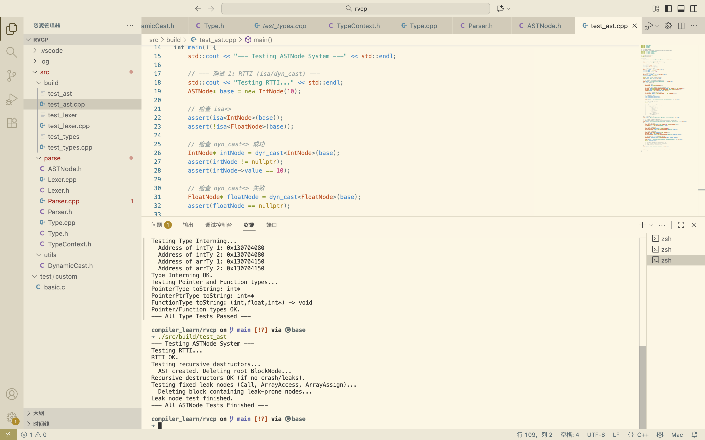

# 2025.11.14 前端——ASTNode

节点的分类很难想，翻看一些程序，有所启发

大致分为以下几类：

1. Literals
2. Var
3. expr
4. stat
5. Func
6. Array

其中考虑到父子节点的包含关系，以及子节点的析构问题

需要建立所有权规则为：**父节点包含子节点时，需要进行析构 `delete` ；但对于语义处理后所有权被转移到其他地方，它们只是临时容器的情况，则不需要添加析构函数**

特别地，

我用了`BlockNode`作为新作用域来存储域内包含的各个子节点，即`{...}`；

并且区分于这个，我用`TransparentBlockNode`，在不创建作用域的情况下，打包多个Var的Dec，即`int a, b;`


起初效仿mlir前端设计，我想要用访问者模式结合作用域操作来实现，但很快意识到，这将带来巨大的代码量：我需要在每一个子类中都添加一个 `accept(Visitor*)` 方法，并且每当我添加一个新节点，我就必须更新所有的 Visitor 接口，这太脆弱了

因为不是工程项目且没有对AST进行变换的必要，我舍弃了`using ASTWalker = std::function<void(ASTNode*)>;`来遍历节点的方式，采用更简单、更灵活、也更容易在递归调用中传递上下文状态的手动递归方式

用安全换简便，这就是我设计简单底层代码编译器的初衷，此后优化时，再反推


接下来介绍

## **ASTNode.h**

```c++
#include <vector>
// # include <functional>
#include <string>
#include "Type.h"

namespace sys{

// using ASTWalker = std::function<void(ASTNode*)>;
  
class ASTNode {
    const int id;
public:
    Type *type = nullptr;
    int getID() const { return id; }
    virtual ~ASTNode() {}
    ASTNode(int id): id(id) {}
};
```

定义ASTNode的基类，type先不用管，在语义阶段进行处理

```c++
template<class T,int NodeID>
class ASTNodeImpl : public ASTNode {
public:
  static bool classof(ASTNode *node) {
      return node->getID() == NodeID;
  }
    ASTNodeImpl(): ASTNode(NodeID) {}
};
```

定义实现类模板

```c++
class IntNode : public ASTNodeImpl<IntNode, __LINE__> {
public:
    int value;
    IntNode(int value): value(value) {}
};

class FloatNode : public ASTNodeImpl<FloatNode, __LINE__> {
public:
    float value;
    FloatNode(float value): value(value) {}
};
```

字面量类

```c++
// variable Dec.
class VarDeclNode : public ASTNodeImpl<VarDeclNode, __LINE__> {
public:
    std::string name;
    ASTNode *init; // can be nullptr.
    bool mut;
    bool global;

    VarDeclNode(const std::string &name, ASTNode *init, bool mut = true, bool global = false):
        name(name), init(init), mut(mut), global(global) {}
    ~VarDeclNode() { delete init; }
};

// variable Use.
class VarRefNode : public ASTNodeImpl<VarRefNode, __LINE__> {
public:
    std::string name;
    VarRefNode(const std::string &name): name(name) {}
};
```

变量类，处理声明和引用

Def时需要注意变量是否初始化了，是否有可变属性，是否有全局属性

Use时需要注意到变量名即可

```c++
// a scoped block.
class BlockNode : public ASTNodeImpl<BlockNode, __LINE__> {
public:
    std::vector<ASTNode*> nodes;
    BlockNode(const decltype(nodes) &n): nodes(n) {}
    ~BlockNode() { for (auto node : nodes) delete node; }
};

// does not create a new scope,
// note that variables declared inside will still be in the outer scope.
class TransparentBlockNode : public ASTNodeImpl<TransparentBlockNode, __LINE__> {
public:
    std::vector<VarDeclNode*> nodes;
    TransparentBlockNode(const decltype(nodes) &n): nodes(n) {}
};
```

代码块类，`decltype`可以在编译时查找参数成员的类型，如`decltype(nodes)`等价于`std::vector<ASTNode*>`

```c++
class BinaryNode : public ASTNodeImpl<BinaryNode, __LINE__> {
public:
  enum {
    Add, Sub, Mul, Div, Mod, And, Or,
    // >= and > Canonicalized.
    Eq, Ne, Le, Lt
  } kind;

  ASTNode *l, *r;

  BinaryNode(decltype(kind) k, ASTNode *l, ASTNode *r):
    kind(k), l(l), r(r) {}
  ~BinaryNode() { delete l; delete r; }
};

class UnaryNode : public ASTNodeImpl<UnaryNode, __LINE__> {
public:
  enum {
    Not, Minus, Float2Int, Int2Float
  } kind;
  ASTNode *node;
    UnaryNode(decltype(kind) k, ASTNode *node):
        kind(k), node(node) {}
    ~UnaryNode() { delete node; }
};

class AssignNode : public ASTNodeImpl<AssignNode, __LINE__> {
public:
    ASTNode *l, *r;
    AssignNode(ASTNode *l, ASTNode *r):
        l(l), r(r) {}
    ~AssignNode() { delete l; delete r; }
};
```

表达式类，二元和一元的，此处设计单元的转换，但也仅仅只设计了int和float的互转

值得注意的是，我设计>= 和 > 可被解析转为<= 和 <，简化AST构建以及后续的语义分析和codegen代码生成

```c++
class FnDeclNode : public ASTNodeImpl<FnDeclNode, __LINE__> {
public:
    std::string name;
    std::vector<std::string> params;
    BlockNode *body;
    FnDeclNode(const std::string &name, const decltype(params) &params, BlockNode *body):
        name(name), params(params), body(body) {}
    ~FnDeclNode() { delete body; }
};

class CallNode : public ASTNodeImpl<CallNode, __LINE__> {
public:
    std::string callee;
    std::vector<ASTNode*> args;
    CallNode(const std::string &callee, const decltype(args) &args):
        callee(callee), args(args) {}
    ~CallNode() { for (auto arg : args) delete arg; }
};
```

函数类，拆解为函数名+参数+函数体`{...}`

CallNode则关注被调用者函数名，入参

```c++
class ConstArrayNode : public ASTNodeImpl<ConstArrayNode, __LINE__> {
public:
    union{
        int *vi;
        float *vf;
    };
    bool isFloat;
    ConstArrayNode(int *vi): vi(vi), isFloat(false) {}
    ConstArrayNode(float *vf): vf(vf), isFloat(true) {}
};

class LocalArrayNode : public ASTNodeImpl<LocalArrayNode, __LINE__> {
public:
    ASTNode **elements;
    LocalArrayNode(ASTNode **elements): elements(elements) {}
    ~LocalArrayNode() {
        // assume elements is null-terminated
        for (int i = 0; elements[i] != nullptr; i++) {
            delete elements[i];
        }
        delete[] elements;
    }
};

class ArrayAccessNode : public ASTNodeImpl<ArrayAccessNode, __LINE__> {
public:
    std::string array;
    std::vector<ASTNode*> indices;
    Type *arrayType = nullptr; // Filled during semantic analysis.
    ArrayAccessNode(const std::string &array, const std::vector<ASTNode*> &indices):
        array(array), indices(indices) {}
    ~ArrayAccessNode() {
        for (auto idx : indices) delete idx;
    }
};

class ArrayAssignNode : public ASTNodeImpl<ArrayAssignNode, __LINE__> {
public:
    std::string array;
    std::vector<ASTNode*> indices;
    ASTNode *value;
    Type *arrayType = nullptr; // Filled during semantic analysis.
    ArrayAssignNode(const std::string &array, const decltype(indices) &indices, ASTNode *value):
        array(array), indices(indices), value(value) {}
    ~ArrayAssignNode() {
        for (auto idx : indices) delete idx;
        delete value;
    }
};
```

数组类

分为常量数组（后续考虑到常量折叠）、局部数组（`int x = 10; int a[2] = {x, x + 5};`）、数组访问、数组赋值

注意ASTNode * 的使用，即elements**

```c++
class ReturnNode : public ASTNodeImpl<ReturnNode, __LINE__> {
public:
    ASTNode *node; // can be nullptr.
    std::string func;
    ReturnNode(const std::string &func, ASTNode *node):
        func(func), node(node) {}
    ~ReturnNode() { delete node; }
};

class IfNode : public ASTNodeImpl<IfNode, __LINE__> {
public:
      ASTNode *cond, *ifso, *ifnot;

  IfNode(ASTNode *cond, ASTNode *ifso, ASTNode *ifnot):
    cond(cond), ifso(ifso), ifnot(ifnot) {}
  ~IfNode() { delete cond; delete ifso; delete ifnot; }
};

class WhileNode : public ASTNodeImpl<WhileNode, __LINE__> {
public:
    ASTNode *cond, *body;
    WhileNode(ASTNode *cond, ASTNode *body):
        cond(cond), body(body) {}
    ~WhileNode() { delete cond; delete body; }
};

class BreakNode : public ASTNodeImpl<BreakNode, __LINE__> {};
class ContinueNode : public ASTNodeImpl<ContinueNode, __LINE__> {};
class EmptyNode : public ASTNodeImpl<EmptyNode, __LINE__> {};
```

语句类


## 测试

```shell
compiler_learn/rvcp on  main [!?] via 🅒 base 
➜ g++ -std=c++17 -Wall -Wextra -I. -o src/build/test_ast src/build/test_ast.cpp
In file included from src/build/test_ast.cpp:9:
src/build/../parse/ASTNode.h:117:9: warning: field 'func' will be initialized after field 'node' [-Wreorder-ctor]
  117 |         func(func), node(node) {}
      |         ^~~~~~~~~~  ~~~~~~~~~~
      |         node(node)  func(func)
1 warning generated.

compiler_learn/rvcp on  main [!?] via 🅒 base 
➜ ./src/build/test_ast  
--- Testing ASTNode System ---
Testing RTTI...
RTTI OK.
Testing recursive destructors...
  AST created. Deleting root BlockNode...
Recursive destructors OK (if no crash/leaks).
Testing fixed leak nodes (Call, ArrayAccess, ArrayAssign)...
  Deleting block containing leak-prone nodes...
Leak node test finished.
--- All ASTNode Tests Finished ---
```



`test_ast.cpp`：验证如下

1. 验证了 RTTI (运行时类型信息) 

- **测试内容**：`"Testing RTTI..."` 模块创建了一个 `IntNode(10)`，但将其存储在一个**基类指针** `ASTNode* base` 中。
- **验证了什么**：
  - `assert(isa<IntNode>(base))` 验证了 `isa<>` 可以正确识别类型。
  - `assert(!isa<FloatNode>(base))` 验证了 `isa<>` 不会发生混淆。
  - `assert(dyn_cast<IntNode>(base) != nullptr)` 验证了 `dyn_cast<>` 可以在**成功**时返回正确的指针。
  - `assert(dyn_cast<FloatNode>(base) == nullptr)` 验证了 `dyn_cast<>` 可以在**失败**时返回 `nullptr`。
- **深层含义**：这证明了 `ASTNodeImpl`、`__LINE__`、`getID()` 和 `classof()` 这套自定义 RTTI 机制**完全按预期工作**。

2. 验证了 AST 的所有权和递归析构 

- **测试内容**：`"Testing recursive destructors..."` 模块构建了一棵复杂的 AST 树（`BlockNode` -> `IfNode` -> `BinaryNode`...），然后只 `delete` 了**根节点** (`delete root`)。
- **验证了什么**：
  - 程序**没有崩溃**。
  - **最重要的**：这验证了 `ASTNode.h` 中**“父节点拥有子节点”**的内存管理模型是**正确的**。
  - `delete root`（一个 `BlockNode`）触发了它的析构函数 `~BlockNode()`。
  - `~BlockNode()` 接着 `delete` 了 `IfNode` 和 `VarDeclNode`。
  - `~IfNode()` 接着 `delete` 了 `BinaryNode` 和 `BlockNode`（`body`）。
  - ...这个**级联删除 (cascading delete)** 一直持续到叶节点（`IntNode`）。
- **深层含义**：证明了 `BlockNode`, `VarDeclNode`, `BinaryNode`, `ReturnNode`, `IfNode` 等的析构函数 都在正常工作。

3. 验证了内存泄漏 Bug 的修复 

- **测试内容**：`"Testing fixed leak nodes..."` 模块专门测试了 `CallNode`、`ArrayAccessNode` 和 `ArrayAssignNode`。这些是 `compiler_rv` 原始代码中**缺少**析构函数的类。
- **验证了什么**：
  - 程序**没有崩溃**。
  - 这证明了你（在 `test_ast.cpp` 中假设你已经修复了）为这三个类添加的**自定义析构函数**是**正确**的。
  - 它验证了 `CallNode::~CallNode()` 正确地 `delete` 了 `args` 向量中的所有 `ASTNode`。
  - 它验证了 `ArrayAccessNode::~ArrayAccessNode()` 正确地 `delete` 了 `indices` 向量中的所有 `ASTNode`。
  - 它验证了 `ArrayAssignNode::~ArrayAssignNode()` 正确地 `delete` 了 `indices` 向量和 `value` 指针。