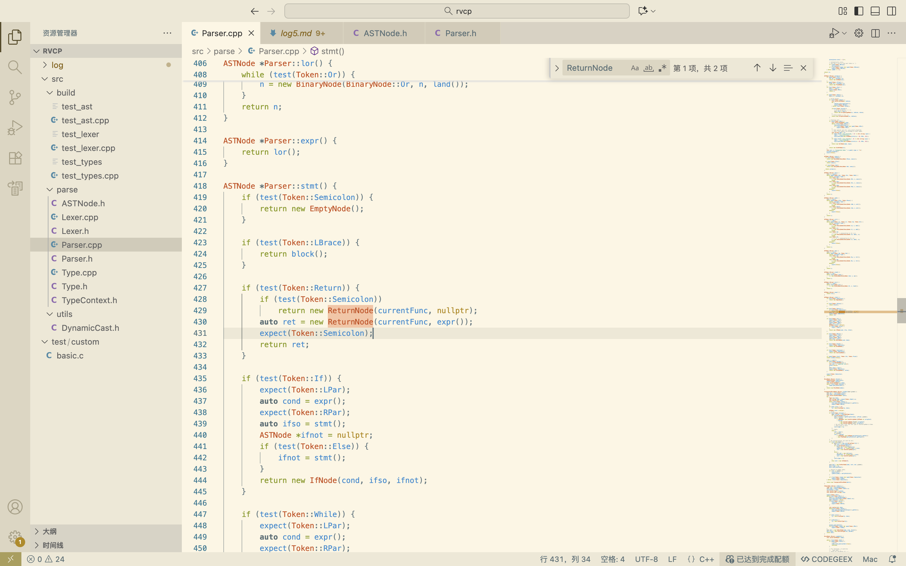

# 2025.11.18 前端 —— Parser顶层设计和入口函数

## Parser.cpp （完）

今天完成了 `Parser.cpp` 的最后一部分实现。这包括顶层解析逻辑（`fnDecl` 函数声明解析和 `compUnit`）、常量折叠引擎（`earlyFold`），以及 `Parser` 的构造函数和`parse()` 入口

```c++
FnDeclNode *Parser::fnDecl() {
  Type *ret = parseSimpleType();
  auto name = expect(Token::Ident).vs;
  currentFunc = name; 
```

设置解析器状态，以便 `stmt()` 中的 `ReturnNode` 能获取到它所属的函数名



```c++
std::vector<std::string> args;
std::vector<Type*> params;

expect(Token::LPar);
while (!test(Token::RPar)) {
  auto ty = parseSimpleType();
  args.push_back(expect(Token::Ident).vs);
```

```c++
bool isPointer = false;
if(test(Token::LBrak)) {
    isPointer = true;
    expect(Token::RBrak);
}
```

通过 `isPointer` 标志来处理 manbin 语言中 `int a[]` 和 `int a[][5]` 退化为指针（`int*` 和 `int(*)[5]`）的规则

值得注意的是！！！manbin语言规范了入参，仅允许数组以 Type a[ ] [x] [y] [...] 的格式作为参数，明确必须带有[ ]来标识其为指针`PointerType`

```c++
// ... (解析剩余维度 [][5][10])
if (dims.size() != 0)
  ty = ctx.create<ArrayType>(ty, dims);
if (isPointer)
  ty = ctx.create<PointerType>(ty);
```

`ty` 变量被用作“构建器”，从内到外被wrapped：`IntType` -> `ArrayType` -> `PointerType`

| 参数形式     | isPointer | dims    | 最终类型                           |
| ------------ | --------- | ------- | ---------------------------------- |
| `int x`      | false     | 空 `{}` | `IntType`                          |
| `int a[]`    | true      | 空 `{}` | `PointerType(IntType)`             |
| `int a[][4]` | true      | `{4}`   | `PointerType(ArrayType(int, {4}))` |

```c++
auto decl = new FnDeclNode(name, args, block());
decl->type = ctx.create<FunctionType>(ret, params);
return decl;
```

`Parser` 在这里同时完成了语义工作。它使用 `ret` 和 `params`（类型列表）创建了 `FunctionType`，并将其附加到 `FnDeclNode` 的 `type` 字段上

参数来源：

* args: 

  `args.push_back(expect(Token::Ident).vs);`

* params:

  ` params.push_back(ty);`


```c++
BlockNode *Parser::compUnit() {
    std::vector<ASTNode*> nodes;

    while (!test(Token::End)) {
        if (peek(Token::Const)) {
            //global
            nodes.push_back(varDecl(true));
            continue;
        }

        // For functions, it would be:
        //   Type ident `(`
        // while for variables it's `=`.
        // Moreover, the Type is only a single token,
        // so we lookahead for 2 tokens.
        if (tokens[loc + 2].type == Token::LPar) {
            nodes.push_back(fnDecl());
            continue;
        }

        nodes.push_back(varDecl(true));
    }

    return new BlockNode(nodes);
}
```

`parse()` 会调用它来实现整个程序的递归下降:

`auto unit = compUnit();`

提前两位loc进行检查——`Parser` 用来区分全局变量声明和函数声明

`return new BlockNode(nodes);`：将所有顶层声明（`FnDeclNode` 和昨天编写的 `TransparentBlockNode`）打包成一个根 `BlockNode` 并返回


```c++
ConstValue Parser::earlyFold(ASTNode *node) {
  // ... (if (dyn_cast<VarRefNode>...))
  // ... (if (dyn_cast<BinaryNode>...))
  // ... (if (dyn_cast<UnaryNode>...))
  // ... (if (dyn_cast<IntNode>...))
  // ... (if (dyn_cast<ArrayAccessNode>...))
  // ... (if (dyn_cast<ConstArrayNode>...))
  // ... (if (dyn_cast<LocalArrayNode>...))
  // ... (assert(false))
}
```

**`if (auto ref = dyn_cast<VarRefNode>(node))`**：在 `symbols` 表中查找常量

**`if (auto lint = dyn_cast<IntNode>(node))`**：返回一个 `ConstValue`（`new int(lint->value)`）

**`if (auto binary = dyn_cast<BinaryNode>(node))`**：递归情况——对左、右子节点 `earlyFold`，然后在 C++ 中执行相应的操作（`l + r`, `l && r` 等），并返回一个新的 `ConstValue` 结果

**`if (auto access = dyn_cast<ArrayAccessNode>(node))`**：递归情况——它在 `symbols` 中查找数组，然后链式调用 `v = v[earlyFold(index).getInt()]` 来模拟数组访问

特别注意的是，对于中间运算结果的内存泄漏很少，不超过2mb，在程序关闭时会统一释放，为了程序简单，不用管

```c++
if (auto access = dyn_cast<ArrayAccessNode>(node)) {
  if (!symbols.count(access->array)) {
    std::cerr << "cannot find constant: " << access->array << "\n";
    assert(false);
  }
  auto array = symbols[access->array];
  ConstValue v = array;
  for (auto index : access->indices)
    v = v[earlyFold(index).getInt()];
  return v;
```

对于数组访问的情况中有这样的语法：

```c++
for (auto index : access->indices)
  v = v[earlyFold(index).getInt()];
return v;
```

对访问语法中每个索引表达式逐一求值，调用earlyFold折叠其为常量，并取出该整型数

这里是因为ConstValue类支持了下表访问的operator `v [行为(idx)] 等价于 v[idx].行为`

用 `ConstValue::operator[] (int)`、对 v 做下标操作（返回子数组或最终元素的 ConstValue），把结果赋回 v，用于下一维索引或最终返回

```c++
if (auto arr = dyn_cast<LocalArrayNode>(node)) {
  // This implies that the whole LocalArray is constant. Try to fold it.
  auto arrTy = cast<ArrayType>(arr->type);
  bool isFloat = isa<FloatType>(arrTy->base);
  if (isFloat) {
    assert(false);
  } else {
    int size = arrTy->getSize();
    int *result = new int[size];
    for (int i = 0; i < size; i++) {
      auto node = arr->elements[i];
      if (!node) {
        result[i] = 0;
        continue;
      }

      result[i] = earlyFold(node).getInt();
    }
    return ConstValue(result, arrTy->dims);
  }
```

`earlyFold`对` LocalArrayNode`有特殊处理：它尝试把所有元素都折叠为常量（若可能），并把结果拷贝到新的原始内存 `int *result`（或 float），返回 `ConstValue(result, dims)` 。也就是说：如果局部数组的每个元素都是常量表达式，编译器会把` LocalArrayNode` 折叠为` ConstValue`（类似全局常量数组）


```c++
Parser::Parser(const std::string &input, TypeContext &ctx): loc(0), ctx(ctx) {
  Lexer lex(input);

  while (lex.hasMore())
    tokens.push_back(lex.nextToken());
}
```

loc(0)：把解析位置索引初始化为 0，后续用来在 tokens 中进行 peek/consume

ctx(ctx)：把外部的TypeContext引用保存到解析器里（注意：这个引用必须在Parser整个生命周期内有效）

`Lexer lex(input)`：在栈上创建一个局部的 Lexer 实例，用来把输入字符串分词为一系列 Token


```c++
ASTNode *Parser::parse() {
  auto unit = compUnit();

  // Release memory.
  for (auto tok : tokens) {
    if (tok.type == Token::Ident)
      delete[] tok.vs;
  }

  return unit;
}
```

执行顶层解析，返回一个BlockNode* 或 ASTNode * AST语法树根

解析完成后，循环遍历tokens，对所有 Token::Ident（标识符）做 `delete[] tok.vs;`，以释放在 Lexer]中为标识符分配的 C 字符串内存（值类型不产生heap分配，所以不用考虑内存泄漏和释放处理）

最后返回解析得到的 AST 根 unit


## 测试

```shell
compiler_learn/rvcp on  main [✘!?] via 🅒 base 
➜ g++ -std=c++17 -Wall -Wextra -I. -o src/build/test_parser \
    src/build/test_parser.cpp \
    src/parse/Lexer.cpp \
    src/parse/Parser.cpp \
    src/parse/Type.cpp
```

```shell
compiler_learn/rvcp on  main [✘!?] via 🅒 base 
➜ ./src/build/test_parser ./test/custom/array.manbin
=== Parsing file: ./test/custom/array.manbin ===

=== Parse Complete. AST Structure: ===

BlockNode (scoped)
  TransparentBlockNode (no scope)
    VarDeclNode (name: a, mut: 1, global: 1)
      (type: int[4][2])
      (init):
      ConstArrayNode (isFloat: 0, type: int[4][2])
  TransparentBlockNode (no scope)
    VarDeclNode (name: largezero, mut: 1, global: 1)
      (type: int[10000])
      (init):
      ConstArrayNode (isFloat: 0, type: int[10000])
  FnDeclNode (name: main)
    (type: () -> int)
    (body):
    BlockNode (scoped)
      TransparentBlockNode (no scope)
        VarDeclNode (name: b, mut: 1, global: 0)
          (type: int[4][2][3])
          (init):
          LocalArrayNode (type: int[4][2][3])
            (elements):
            IntNode (value: 1)
            IntNode (value: 2)
            IntNode (value: 3)
            IntNode (value: 4)
      TransparentBlockNode (no scope)
        VarDeclNode (name: c, mut: 1, global: 0)
          (type: int)
          (init):
          ArrayAccessNode (name: a)
            (indices):
            IntNode (value: 1)
            IntNode (value: 0)
      ArrayAssignNode (name: a)
        (indices):
        IntNode (value: 1)
        IntNode (value: 0)
        (value):
        IntNode (value: 4)
      ArrayAssignNode (name: b)
        (indices):
        IntNode (value: 0)
        IntNode (value: 0)
        IntNode (value: 0)
        (value):
        IntNode (value: 5)
      ReturnNode
        BinaryNode (kind: 0)
          BinaryNode (kind: 0)
            BinaryNode (kind: 0)
              VarRefNode (name: c)
              ArrayAccessNode (name: a)
                (indices):
                IntNode (value: 1)
                IntNode (value: 0)
            ArrayAccessNode (name: b)
              (indices):
              IntNode (value: 0)
              IntNode (value: 0)
              IntNode (value: 0)
          ArrayAccessNode (name: b)
            (indices):
            IntNode (value: 0)
            IntNode (value: 0)
            IntNode (value: 1)

=== Cleaning up AST... ===
=== AST Cleaned Successfully. ===
```

```c++
compiler_learn/rvcp on  main [✘!?] via 🅒 base 
➜ ./src/build/test_parser ./test/custom/basic.manbin
=== Parsing file: ./test/custom/basic.manbin ===

expected 39, but got 2
surrounding:
2 <name = a>
29
0 <int = 1>
36
39
2 <name = count> (here)
33
2 <name = count>
15
0 <int = 1>
32
Assertion failed: (false), function expect, file Parser.cpp, line 128.
[1]    14231 abort      ./src/build/test_parser ./test/custom/basic.manbin
```

basic.manbin出现了崩溃

```c++
compiler_learn/rvcp on  main [✘!?] via 🅒 base 
➜ ./src/build/test_parser ./test/custom/timer.manbin          
=== Parsing file: ./test/custom/timer.manbin ===

expected 39, but got 3
surrounding:
2 <name = i>
27
0 <int = 10000>
36
39
3 (here)
35
2 <name = i>
18
0 <int = 2>
28
Assertion failed: (false), function expect, file Parser.cpp, line 128.
[1]    16507 abort      ./src/build/test_parser ./test/custom/timer.manbin
```

timer.manbin也出现了崩溃