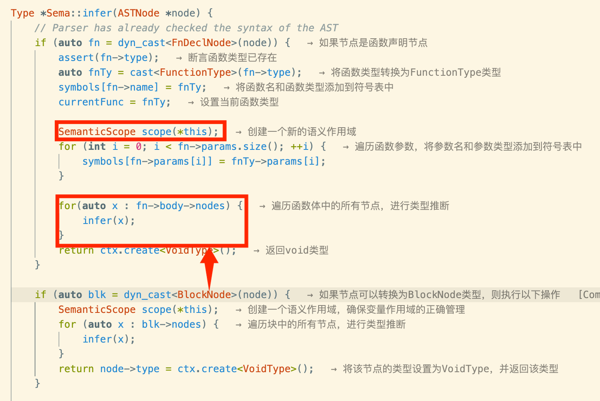

# 2025.11.21 前端——标识符类型匹配 Sema::infer()

我只实现了int和float的简单类型转换，并且在标识符匹配的过程中，着重考虑了类型的兼容性

## Sema.cpp

```c++
// decay array type to pointer type
PointerType* Sema::decay(ArrayType* arrTy) {
    std::vector<int> dims;
    for (int i = 1; i < arrTy->dims.size(); ++i) {
        dims.push_back(arrTy->dims[i]);
    }
    if (!dims.size()) {  
        return ctx.create<PointerType>(arrTy -> base);
    }
    return ctx.create<PointerType>(ctx.create<ArrayType>(arrTy->base, dims));
}

// raise pointer type to array type
ArrayType* Sema::raise(PointerType* ptr) {
    std::vector<int> dims {1};
    Type *base;
    if (auto pointee = dyn_cast<ArrayType>(ptr->baseType)) {
        for (auto x : pointee->dims) {
            dims.push_back(x);
        }
        base = pointee->base;
    }
    else {
        base = ptr->baseType;
    }
    return ctx.create<ArrayType>(base, dims);
}
```

对于数组的子数组以及数组的声明，我们需要将数组类型退化成指针类型——因为当数组作为函数参数传递时，是以指针的形式接收的；

而对于数组的逐维度访问，其最后一次访问是单维度数组的访问，需要将指针类型进化为数组类型

因此，设计了decay、raise

decay移除数组的第一个维度。如果数组是多维的（`int[N][M][P][Q]`），它退化为指向剩余维度数组的指针（`int(*)[M][P][Q]`）；如果数组只剩一维，则退化为指向基类型的指针（`int*`）

raise将指针类型（例如 `int*`）提升为一个数组类型（例如 `int[1]`），默认添加一个维度 `[1]`作为第一维度，如果指针指向的类型本身是数组，则保留其维度


```c++
Type *Sema::infer(ASTNode *node) {
	// --- 1. 函数和作用域管理 ---
  if (auto fn = dyn_cast<FnDeclNode>(node)) { /* 节点: FnDeclNode (函数声明) */ }
  if (auto blk = dyn_cast<BlockNode>(node)) { /* 节点: BlockNode (显式代码块) */ }
  if (auto blk = dyn_cast<TransparentBlockNode>(node)) { /* 节点: TransparentBlockNode (顶层/无作用域块) */ }

  // --- 2. 字面量和简单语句 ---
  if (isa<IntNode>(node)) { /* 节点: IntNode，返回 IntType */ }
  if (isa<FloatNode>(node)) { /* 节点: FloatNode，返回 FloatType */ }
  if (isa<BreakNode>(node)||isa<ContinueNode>(node)|isa<EmptyNode>(node)) { /* 节点: 控制流，返回 VoidType*/ }

  // --- 3. 表达式和类型转换 ---
  if (auto binary = dyn_cast<BinaryNode>(node)) { /* 节点: BinaryNode (二元运算) */ }
  if (auto unary = dyn_cast<UnaryNode>(node)) { /* 节点: UnaryNode (一元运算) */ }
  if (auto vardecl = dyn_cast<VarDeclNode>(node)) { /* 节点: VarDeclNode (变量声明) */ }
  if (auto ret = dyn_cast<ReturnNode>(node)) { /* 节点: ReturnNode (返回语句) */ }
  if (auto ref = dyn_cast<VarRefNode>(node)) { /* 节点: VarRefNode (变量引用) */ }

  // --- 4. 控制流操作 ---
  if (auto branch = dyn_cast<IfNode>(node)) { /* 节点: IfNode */ }
  if (auto loop = dyn_cast<WhileNode>(node)) { /* 节点: WhileNode */ }
  if (auto assign = dyn_cast<AssignNode>(node)) { /* 节点: AssignNode (赋值) */ }
  if (auto call = dyn_cast<CallNode>(node)) { /* 节点: CallNode (函数调用) */ }

  // --- 5. 数组操作 (根据实际实现顺序) ---
  if (auto access = dyn_cast<ArrayAccessNode>(node)) { /* 节点: ArrayAccessNode (数组访问) */ }
  if (auto arr = dyn_cast<LocalArrayNode>(node)) { /* 节点: LocalArrayNode (局部数组初始化) */ }
  if (auto write = dyn_cast<ArrayAssignNode>(node)) { /* 节点: ArrayAssignNode (数组元素赋值) */ }

  // --- 6. 默认错误 ---
  // (assert(false))
}
```



注意，这里红框内的代码不可直接替换成`infer(fn->body)`，要考虑到函数入参也要进入Scope，如果直接替换，那么参数会被永远留在`symbols`里了，导致语义错误

`infer(node)` 的返回值是将当前节点视作表达式/子项计算出来的类型，供上层调用者使用；把类型写回 node->type是“把类型信息记录到 AST 节点上”，供后续阶段（codegen、优化）或者后续重复访问时直接读取——此处`FnDeclNode`，fn->type在 parser/decl 阶段就已经设置好了，所以 Sema 无需再把 VoidType 写回fn->type。而 infer 的返回值VoidType只是表示“函数体的语义结果是 void”，供调用方使用（如果有需要）。因此没有写回node->type并不会丢失函数类型信息。总而言之，需要注意哪些Type返回是上层需要的，哪些Type是在Parser阶段就定义好了的


```c++
if (isa<FloatType>(lty)) {
    auto zero = new FloatNode(0);
    zero -> type = ctx.create<FloatType>();
    auto ne = new BinaryNode(BinaryNode::Ne, binary->l, zero);
    ne -> type = ctx.create<IntType>();
    binary -> l = ne;
}
```

二元运算中的位运算和一些语句的cond计算都需要考虑到如何将当前Value，如果不是整型则需要转换为0，1值

我采取了`! = 0`的方法来转换，并赋值对应节点的Type为IntType

```c++
// INT2FLOAT
if (isa<FloatType>(lty) && isa<IntType>(rty)) {
    binary -> r = new UnaryNode(UnaryNode::Int2Float, binary->r);
    rty = binary -> r -> type = ctx.create<FloatType>();
}

if (isa<IntType>(rty) && isa<FloatType>(lty)) {
    binary -> l = new UnaryNode(UnaryNode::Int2Float, binary->l);
    lty = binary -> l -> type = ctx.create<FloatType>();
}
```

对于类型转换，注意！我都是直接插入UnaryNode节点，而不是直接转换其类型，这是因为后面需要输出这个ast节点对应的ir，ir里需要一句float2int之类的，而直接转变类型的话就没法标记这里需要输出这个了，这样做有助于后续进行精确点优化

```cpp
std::set<decltype(BinaryNode::kind)> intops = {
    BinaryNode::And,BinaryNode::Or, BinaryNode::Eq,
    BinaryNode::Ne, BinaryNode::Le, BinaryNode::Lt,
};

if (isa<FloatType>(lty) && isa<FloatType>(rty) && !intops.count(binary->kind)) {
    return node -> type = ctx.create<FloatType>();
}
```

这里我借助set来简化代码，对于位运算，比较运算其最终结果肯定是bool型的


```c++
if (auto unary = dyn_cast<UnaryNode>(node)) {
    auto ty = infer(unary->node);
    assert(unary->kind != UnaryNode::Float2Int && unary->kind != UnaryNode::Int2Float);
    if (isa<FloatType>(ty) && unary->kind == UnaryNode::Minus) {
        return node -> type = ctx.create<FloatType>();
    }
    return node -> type = ctx.create<IntType>();
}
```

对于一元运算，这里只特别处理了Minus这个kind，其他情况都是位运算，结果为整型，而对于转换，则直接assert，因为我们不需要进行转换UnaryNode节点的推断，他的类型在创建这个节点的时候就紧接着赋值了，如下：

```c++
vardecl->init = new UnaryNode(UnaryNode::Int2Float, vardecl->init);
vardecl->init->type = ctx.create<FloatType>();
```


VarRefNode需要考虑到数组的情况，数组名在表达式中通常表示首元素地址，此时需要用到decay


```c++
ASTNode *&x = call->args[i];  // x是参数的引用
auto ty = infer(x);

// 类型转换时
x = new UnaryNode(UnaryNode::Int2Float, x);  // 会修改原始参数
```

CallNode中，我使用了call->args[i]的引用，简化代码


```cpp
if (auto access = dyn_cast<ArrayAccessNode>(node)) {
    auto realTy = symbols[access->array];
    ArrayType *arrTy;
    if (isa<ArrayType>(realTy))
        arrTy = cast<ArrayType>(realTy);
    else 
        arrTy = raise(cast<PointerType>(realTy));

    access->arrayType = arrTy;
    std::vector<int> NewDims;
    for (int i = access->indices.size(); i < arrTy->dims.size(); i++)
        NewDims.push_back(arrTy->dims[i]);
    // check index type,all must be int.
    for (auto x: access->indices) {
        auto ty = infer(x);
        assert(isa<IntType>(ty));
    }
    auto resultTy = NewDims.size() ? 
    (Type*) decay(ctx.create<ArrayType>(arrTy->base, NewDims))
    : arrTy->base;
    return node->type = resultTy;
}
```

特别注意数组的逐维度处理的操作，并保证其每一个索引都为整型


```c++
if (auto arr = dyn_cast<LocalArrayNode>(node)) {
    assert(node->type);
    auto arrTy = cast<ArrayType>(node->type);
    auto baseTy = arrTy->base;
    auto size = arrTy->getSize();
    for (int i = 0; i < size; i++) {
        auto &x = arr->elements[i];
        if (!x) continue;
        auto ty = infer(x);

        if (isa<FloatType>(ty) && isa<IntType>(baseTy)) {
            x = new UnaryNode(UnaryNode::Float2Int, x);
            x->type = ctx.create<IntType>();
            continue;
        }

        if (isa<IntType>(ty) && isa<FloatType>(baseTy)) {
            x = new UnaryNode(UnaryNode::Int2Float, x);
            x->type = ctx.create<FloatType>();
            continue;
        }
    }
    return node->type;
}
```

局部数组初始化处理，同上面类似


```c++
Sema::Sema(ASTNode *node, TypeContext &ctx):ctx(ctx) {
    auto intTy = ctx.create<IntType>();
    auto floatTy = ctx.create<FloatType>();
    auto voidTy = ctx.create<VoidType>();
    // use ArrayType{1} to represent Array Pointer
    auto intPtrTy = ctx.create<ArrayType>(intTy, std::vector<int> {1});
    auto floatPtrTy = ctx.create<ArrayType>(floatTy, std::vector<int> {1});

    using Args = std::vector<Type*>;
    Args empty;

    symbols = {
        { "getint", ctx.create<FunctionType>(intTy, empty) },
        { "getch", ctx.create<FunctionType>(intTy, empty) },
        { "getfloat", ctx.create<FunctionType>(floatTy, empty) },
        { "getarray", ctx.create<FunctionType>(intTy, Args { intPtrTy }) },
        { "getfarray", ctx.create<FunctionType>(intTy, Args { floatPtrTy } ) },
        { "putint", ctx.create<FunctionType>(voidTy, Args { intTy }) },
        { "putch", ctx.create<FunctionType>(voidTy, Args { intTy }) },
        { "putfloat", ctx.create<FunctionType>(voidTy, Args { floatTy }) },
        { "putarray", ctx.create<FunctionType>(voidTy, Args { intTy, intPtrTy }) },
        { "putfarray", ctx.create<FunctionType>(voidTy, Args { intTy, floatPtrTy }) },
        { "_sysy_starttime", ctx.create<FunctionType>(voidTy, Args { intTy }) },
        { "_sysy_stoptime", ctx.create<FunctionType>(voidTy, Args { intTy }) },
    };

    infer(node);
}
```

Sema初始化函数，这里我使用 `ArrayType{1}` 来表示指针类型， `int[1]` 实际上表示 `int*`，用一维数组模拟指针

虽然多维数组的指针表示是int[]...，但是二者并不冲突

声明内置函数：使编译器正确处理标准库函数的调用

- 输入函数：getint, getch, getfloat
- 数组输入：getarray, getfarray
- 输出函数：putint, putch, putfloat
- 数组输出：putarray, putfarray
- 性能分析：_sysy_starttime, _sysy_stoptime

每个函数的类型定义包含：

- 返回类型
- 参数类型列表

如：`{ "getarray", ctx.create<FunctionType>(intTy, Args { intPtrTy }) }`对应于

`int getarray(int*);`


## 测试

```shell
compiler_learn/rvcp on  main [!?] via 🅒 base 
➜ g++ -std=c++17 -Wall -Wextra -I. -Isrc/parse -Isrc/utils -o src/build/test_sema \     
    src/build/test_sema.cpp \
    src/parse/Sema.cpp \
    src/parse/Type.cpp \
    src/parse/Parser.cpp \
    src/parse/Lexer.cpp
```

```shell
compiler_learn/rvcp on  main [!?] via 🅒 base 
➜ ./src/build/test_sema ./test/custom/basic.manbin     
=== Starting Sema Analysis for: ./test/custom/basic.manbin ===

=== Sema Analysis Complete. Resulting AST: ===

- BlockNode (Scoped) (Type: void)
  - TransparentBlockNode (ROOT) (Type: void)
    - VarDeclNode (Type: int)
        Name: count, Mut: 1, Global: 1
      (Init Value):
      - IntNode (Value: 0) (Type: int)
  - FnDeclNode (Type: () -> int)
      Name: main, Params: 0
    (Body):
    - BlockNode (Scoped) (Type: NoType)
      - TransparentBlockNode (ROOT) (Type: void)
        - VarDeclNode (Type: int)
            Name: a, Mut: 1, Global: 0
          (Init Value):
          - IntNode (Value: 7) (Type: int)
      - WhileNode (Type: void)
        (Condition):
        - BinaryNode (Type: int)
            Kind: 8 (Add=0, Ne=9, And=5, etc.)
          (LHS):
          - VarRefNode (Type: int)
              Name: a
          (RHS):
          - IntNode (Value: 1) (Type: int)
        (Body):
        - BlockNode (Scoped) (Type: void)
          - !!! UNKNOWN ASTNode (ID: 138) !!! (Type: void)
          - IfNode (Type: void)
            (Condition):
            - BinaryNode (Type: int)
                Kind: 7 (Add=0, Ne=9, And=5, etc.)
              (LHS):
              - BinaryNode (Type: int)
                  Kind: 4 (Add=0, Ne=9, And=5, etc.)
                (LHS):
                - VarRefNode (Type: int)
                    Name: a
                (RHS):
                - IntNode (Value: 2) (Type: int)
              (RHS):
              - IntNode (Value: 0) (Type: int)
            (If-So Block):
            - BlockNode (Scoped) (Type: void)
              - !!! UNKNOWN ASTNode (ID: 138) !!! (Type: void)
            (Else Block):
            - BlockNode (Scoped) (Type: void)
              - !!! UNKNOWN ASTNode (ID: 138) !!! (Type: void)
      - ReturnNode (Type: NoType)
        (Value):
        - VarRefNode (Type: int)
            Name: count

=== Test Finished Successfully. ===

compiler_learn/rvcp on  main [?] via 🅒 base 
➜ ./src/build/test_sema ./test/custom/float.manbin          
=== Starting Sema Analysis for: ./test/custom/float.manbin ===

=== Sema Analysis Complete. Resulting AST: ===

- BlockNode (Scoped) (Type: void)
  - FnDeclNode (Type: (float) -> float)
      Name: square, Params: 1
    (Body):
    - BlockNode (Scoped) (Type: NoType)
      - ReturnNode (Type: NoType)
        (Value):
        - BinaryNode (Type: float)
            Kind: 2 (Add=0, Ne=9, And=5, etc.)
          (LHS):
          - VarRefNode (Type: float)
              Name: x
          (RHS):
          - VarRefNode (Type: float)
              Name: x
  - FnDeclNode (Type: () -> int)
      Name: main, Params: 0
    (Body):
    - BlockNode (Scoped) (Type: NoType)
      - TransparentBlockNode (ROOT) (Type: void)
        - VarDeclNode (Type: float)
            Name: x, Mut: 1, Global: 0
          (Init Value):
          - FloatNode (Value: 1.230000) (Type: float)
      - TransparentBlockNode (ROOT) (Type: void)
        - VarDeclNode (Type: int)
            Name: y, Mut: 1, Global: 0
          (Init Value):
          - UnaryNode (Type: int)
              Kind: 2 (F2I=2, I2F=3)
            (Operand):
            - BinaryNode (Type: float)
                Kind: 0 (Add=0, Ne=9, And=5, etc.)
              (LHS):
              - VarRefNode (Type: float)
                  Name: x
              (RHS):
              - FloatNode (Value: 2.460000) (Type: float)
      - ReturnNode (Type: NoType)
        (Value):
        - UnaryNode (Type: int)
            Kind: 2 (F2I=2, I2F=3)
          (Operand):
          - BinaryNode (Type: float)
              Kind: 1 (Add=0, Ne=9, And=5, etc.)
            (LHS):
            - BinaryNode (Type: float)
                Kind: 2 (Add=0, Ne=9, And=5, etc.)
              (LHS):
              - CallNode (Type: float)
                  Name: square
                  (Args):
                - UnaryNode (Type: float)
                    Kind: 3 (F2I=2, I2F=3)
                  (Operand):
                  - VarRefNode (Type: int)
                      Name: y
              (RHS):
              - FloatNode (Value: 4.300000) (Type: float)
            (RHS):
            - FloatNode (Value: 5.500000) (Type: float)

=== Test Finished Successfully. ===
```

| **序号** | **验证的编译器组件**         | **验证的具体语义和逻辑**                                     |
| -------- | ---------------------------- | ------------------------------------------------------------ |
| **I**    | **前端流程集成**             | 验证 Lexer、Parser 和 Sema 能够成功串联，即程序能够读取源代码、生成 AST，并将 AST 完整地传递给 Sema 进行处理。 |
| **II**   | **类型标注的完整性**         | 确保 AST 中的所有表达式节点（`IntNode`、`BinaryNode`、`VarRefNode` 等）都具有一个非空的 `node->type` 成员，证明 Sema 已经成功推导出其类型。 |
| **III**  | **类型推导的准确性**         | 验证 `FnDeclNode` 上的 `Type` 成员（函数签名）和 `VarDeclNode` 上的 `Type` 成员（变量类型）是否与源代码中的声明一致。 |
| **IV**   | **隐式类型提升 (Int/Float)** | 验证 `BinaryNode` 逻辑：当 `int` 和 `float` 类型混合运算时，`ASTPrinter` 确认 `Sema` 插入了 `UnaryNode (Kind: 3) [Int2Float]` 节点，确保运算在浮点精度下进行。 |
| **V**    | **强制类型转换 (Float/Int)** | 验证 `ReturnNode` 和 `AssignNode` 逻辑：当赋值或返回类型不匹配时（例如 `int y = float_expr`），`ASTPrinter` 确认 `Sema` 插入了 `UnaryNode (Kind: 2) [Float2Int]` 节点。 |
| **VI**   | **浮点数布尔语义**           | 验证 `IfNode` 和 `WhileNode` 逻辑：如果条件是浮点类型，`Sema` 是否将其转换成 `BinaryNode (Kind: 9) [Ne]` 形式的 **`expr != 0.0`** 整数比较表达式。 |
| **VII**  | **数组衰退和访问**           | 1. 验证 `VarRefNode`（当引用数组名时）的推导类型是否从 `ArrayType` 衰退为 `PointerType`。                 2. 验证 `ArrayAccessNode` 的推导结果（最终元素类型或子数组指针）。 |
| **VIII** | **作用域和符号管理**         | 验证 `FnDeclNode` 和 `BlockNode` 正确创建了隔离作用域，并通过 `VarRefNode` 的类型查找来间接确认符号表（Symbol Table）管理是正确的。 |
| **IX**   | **结构和析构**               | 验证 `ASTPrinter` 能够正确识别并遍历 `TransparentBlockNode` (作为根容器) 和 `BlockNode`，确保 AST 结构的完整性，并在程序退出时通过 `delete root` 递归清理了所有 AST 内存。 |